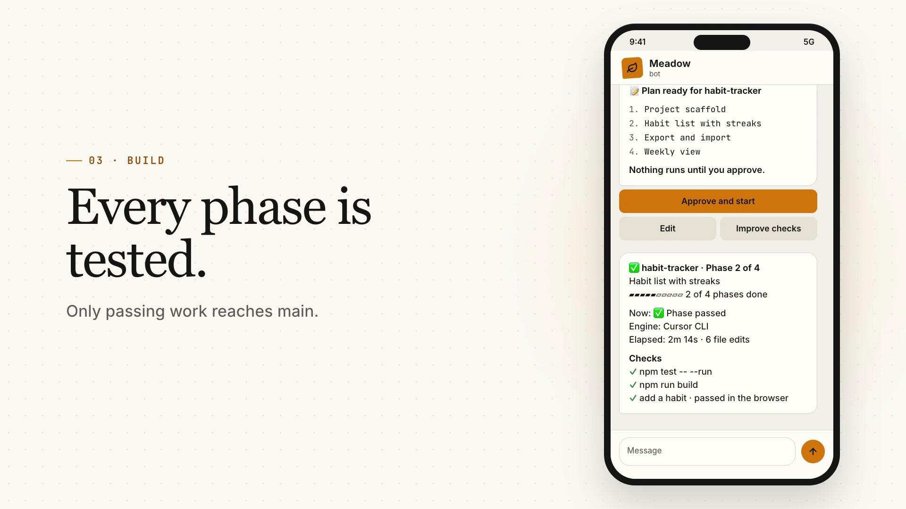

# Meadow

**Describe what you want. Meadow plans it, builds it phase by phase with a real coding engine, tests every step, and reports back to you on Telegram.**

[](https://github.com/khushali6/Meadow/actions/workflows/ci.yml)
[](LICENSE)


[](docs/media/meadow-brag.mp4)

Meadow runs on your own computer. You send a request from the dashboard or Telegram (text, voice or a `PLAN.md`), approve the plan, and Meadow drives a coding engine such as the Cursor CLI until every phase passes its checks. Your code, memory and keys stay on your machine.

## Highlights

- **Plan first, code second.** Meadow asks a few questions, writes a spec and a phased plan, and changes nothing until you approve it.
- **Every phase is tested.** Each phase runs on its own git branch with checks that can actually fail. Failures go back to the engine with the real error, up to three times, and only passing work reaches `main`.
- **Real browser tests.** For web apps, Meadow starts the app, clicks through each main user flow in a headless browser and sends you desktop and mobile screenshots.
- **Runs from your phone.** Approve plans, answer the engine's questions, and follow live progress on Telegram.
- **Remembers your project.** A local search index, notes and a knowledge graph (CodeAtlas) of your services, APIs, tables and history let Meadow answer questions like *"why did payments start failing after v2.4?"* with cited evidence.
- **A supervised team.** A supervisor model (Ollama, FreeLLMAPI or Claude) reviews failures, and independent phases can run in parallel.
- **Designed, not default.** Web projects follow a built-in design standard with approved free libraries (shadcn/Radix, Motion, GSAP), plus any skills you add.
- **Asks before it acts.** Risky commands and writes need your approval, everything is audited, and secrets never appear in prompts, logs or the UI.

## Quick start

You need **Node.js 22.16+ or 24+**, **git**, a **coding engine** you're signed in to (the Cursor CLI is the most tested) and an **agent model** (Ollama, LM Studio, FreeLLMAPI, or an OpenAI, Anthropic, Gemini or OpenRouter key).

```bash
git clone https://github.com/khushali6/Meadow.git && cd Meadow
./startup.sh                                              # macOS, Linux, WSL
powershell -ExecutionPolicy Bypass -File .\startup.ps1    # Windows
```

The startup script installs Node.js if needed, builds Meadow, then walks you through setup: it finds or tests your agent model, connects your coding engine, and helps you create and pair a Telegram bot (optional). Then it opens the dashboard.

**Just want to look around?** Try the whole flow with the built-in fake engine. It needs no engine, model or keys:

```bash
pnpm install && pnpm build
MEADOW_ENGINE=fake node dist/cli.js run examples/DEMO-PLAN.md
```

## How it works

```
Request ─▶ Questions ─▶ Spec + plan ─▶ Your approval ─▶ Phase 1 ─▶ Phase 2 ─▶ … ─▶ Browser tests ─▶ Report
                                                         │ build → check → fix (×3) → merge
```

1. **Request.** Describe a new app, a feature or a bug.
2. **Plan.** Meadow writes `SPEC.md` and a phased `PLAN.md` ([example](examples/PLAN.md)).
3. **Approve.** On the dashboard or with one tap on Telegram.
4. **Build.** The engine works phase by phase. Guards check each change, tests run, failures get fixed.
5. **Report.** You get what changed, what passed, and screenshots.

## Common commands

| Command | What it does |
| --- | --- |
| `meadow start` | Start the dashboard and Telegram bot |
| `meadow doctor` | Check Node, git, engines, model and extras, with a fix for each problem |
| `meadow run PLAN.md` | Run a plan from the terminal |
| `meadow status` | Show progress |
| `meadow atlas ask <project> "<question>"` | Ask CodeAtlas about your system |

The full list is in the [guide](docs/GUIDE.md#commands).

## Good to know

- **Beta.** CI tests every commit on macOS, Linux and Windows with Node 22.16, 24 and 26, but expect rough edges.
- **Hardware.** A local Ollama supervisor such as `qwen2.5:14b` wants about 16–24 GB of RAM. On smaller machines, use FreeLLMAPI or an API key.
- **Checks decide.** Meadow verifies what the checks measure, so a weak check proves little. Browser screenshots work for web apps on localhost only.
- **You stay in charge of accounts.** Meadow never signs in for you, never reads `.env` files, and asks before anything that costs money.

## Learn more

- [Full guide](docs/GUIDE.md): setup, Telegram, CodeAtlas, model providers, plan format, configuration
- [Edge cases](docs/EDGE-CASES.md): what can go wrong and how to fix it
- [Security](SECURITY.md): the security model and how to report issues
- [Contributing](CONTRIBUTING.md): development setup and tests

Found a bug? [Open an issue](https://github.com/khushali6/Meadow/issues).

## License

MIT. See [LICENSE](LICENSE).
